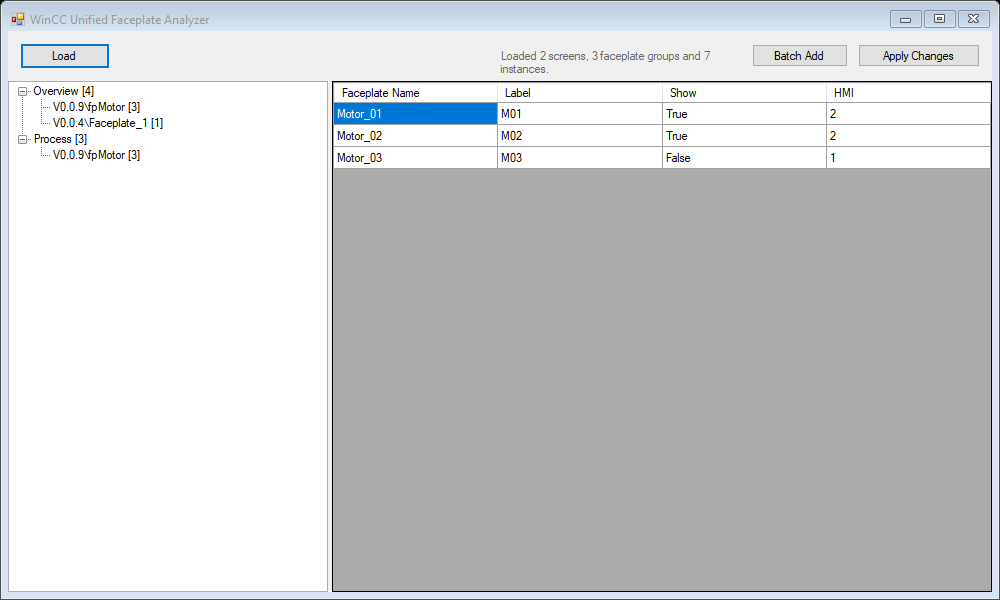
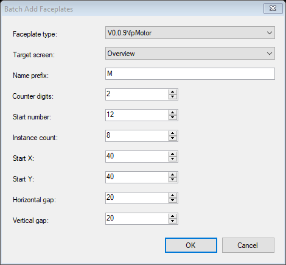

# WinCC Unified Faceplate Analyzer

WinCC Unified Faceplate Analyzer is a Windows desktop utility for inspecting, editing, and creating WinCC Unified faceplate instances in an open Siemens TIA Portal project.

The application uses the TIA Portal Openness API directly. It is intended to make repetitive faceplate work faster, especially when the same interface properties must be reviewed or updated across many instances.

## Screenshots

### Faceplate overview and editing



### Batch Add



## Features

- Connects to a running TIA Portal V21 instance and its open project.
- Detects available WinCC Unified runtimes.
- Scans all screens, including screens inside nested screen groups.
- Displays only screens that contain at least one faceplate instance.
- Groups faceplate instances by screen and faceplate type.
- Shows interface properties in an editable table.
- Applies each row's values to its corresponding faceplate instance.
- Displays Siemens multilingual `ProjectText` values as readable plain text.
- Supports copying and pasting table cells to and from Microsoft Excel with `Ctrl+C` and `Ctrl+V`.
- Creates multiple faceplate instances with the Batch Add tool.

## Batch Add

Batch Add creates a numbered set of faceplate instances on a selected screen.

Faceplate types are collected from a screen named `tpl`. Add at least one sample instance of every faceplate type you want to use to this screen. Each supported faceplate type must expose an interface property named `Label`.

The Batch Add dialog provides:

- Faceplate type selection from the `tpl` screen.
- Target screen selection from all available screens.
- Instance name prefix, such as `M`, `V`, or `FT`.
- Counter width. For example, a width of `3` produces `001`, `002`, and `003`.
- Starting number.
- Number of instances to create.
- Grid start coordinates.
- Horizontal and vertical spacing.

The generated instance name is also written to the faceplate's `Label` interface property. For example, prefix `M`, counter width `2`, and starting number `12` produce `M12`, `M13`, and so on.

Instances are arranged in a grid using the size of the sample faceplate on `tpl`. The grid automatically wraps according to the target screen width. Before making changes, the application checks for duplicate object names and verifies that the complete grid fits inside the target screen. Creation is performed inside a TIA Portal transaction, so a failed batch is rolled back.

## Requirements

- Windows.
- Siemens TIA Portal V21 with WinCC Unified and the V21 Openness API installed.
- An open TIA Portal project containing at least one WinCC Unified runtime.
- Membership in the `Siemens TIA Openness` Windows user group.
- Visual Studio with .NET Framework 4.8 development tools when building from source.

The project references the Siemens assemblies from the standard V21 installation directory:

```text
C:\Program Files\Siemens\Automation\Portal V21\PublicAPI\V21\net48
```

If TIA Portal is installed elsewhere, update the assembly reference paths in `FKAroundTIA/FKAroundTIA.csproj`.

## Building

1. Clone the repository.
2. Open `FKAroundTIA.slnx` in Visual Studio.
3. Confirm that all `Siemens.Engineering.*` references resolve to the V21 PublicAPI assemblies.
4. Build the project.

The application does not require additional NuGet packages.

## Usage

1. Start TIA Portal V21 and open the project you want to work with.
2. Run WinCC Unified Faceplate Analyzer.
3. Click **Load**.
4. Select a runtime if the project contains more than one.
5. Select a screen and a faceplate type in the tree.
6. Edit interface values directly in the table, or paste a range copied from Excel.
7. Click **Apply Changes** to write the displayed values to their corresponding instances.

To create instances, click **Batch Add**, complete the dialog, and click **OK**. Clicking **Cancel** closes the dialog without modifying the project.

## Important Notes

- The application modifies the project currently open in TIA Portal. Use version control or create a project backup before performing bulk operations.
- The application does not automatically save the TIA Portal project. Review the result in TIA Portal and save it manually when ready.
- The application attaches to the first compatible running TIA Portal process and uses its first open project.
- This version targets TIA Portal V21 and WinCC Unified. It is not intended for classic WinCC HMI projects.

## Project Structure

```text
FKAroundTIA/Forms/       WinForms user interface
FKAroundTIA/Models/      Data passed between the UI and services
FKAroundTIA/Services/    TIA Portal access, screen scanning, faceplate editing, clipboard support, and batch creation
```

The project follows a straightforward WinForms architecture and does not use MVVM.

## Disclaimer

This is an independent utility and is not affiliated with or endorsed by Siemens. Siemens, SIMATIC, TIA Portal, and WinCC are trademarks of Siemens AG.
